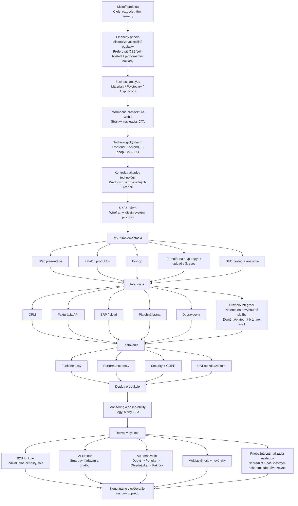

# Vývojový diagram projektu WEB-Interia

Táto stránka obsahuje detailnejší, stále editovateľný Mermaid diagram vývoja webu.

**Základný princíp nákladov:** neplatiť režijné poplatky za web, resp. platiť iba najnutnejšie služby. Preferovať open-source/self-hosted riešenia a jednorazové náklady, ak sú potrebné.

