# Vývojový diagram projektu WEB-Interia

Táto stránka obsahuje detailnejší, stále editovateľný Mermaid diagram vývoja webu.

**Základný princíp nákladov:** neplatiť režijné poplatky za web, resp. platiť iba najnutnejšie služby. Preferovať open-source/self-hosted riešenia a jednorazové náklady, ak sú potrebné.

**Základný integračný princíp:** **„raz a dosť“** — tovary, materiály a vybrané obchodné údaje sa spravujú primárne v externých skladových/ERP systémoch a web ich iba čerpá, synchronizuje a zapisuje späť iba potrebné zmeny.

**Základný legislatívny a bezpečnostný princíp:** web musí byť navrhnutý a prevádzkovaný v súlade so slovenskou a európskou legislatívou a musí spĺňať vysokú mieru bezpečnosti, ochrany osobných údajov a odolnosti voči zneužitiu.

**Základný princíp komunikácie:** web musí bezpečne archivovať všetku komunikáciu so zákazníkmi aj dodávateľmi. Komunikácia má byť dostupná v prehľadnom režime podľa konkrétnej sekcie/procesu, s viacerými filtrami, a zároveň aj v spoločnom pohľade voči danému zákazníkovi alebo dodávateľovi.

**Základný komunitno-vzdelávací princíp:** web má obsahovať samostatnú sekciu pre ľudí, ktorí prejavia vážnejší záujem o odbor, produkty, materiály, postupy alebo spoluprácu. Názov sekcie: **I-zóna**. Sekcia má obsahovať odborné rady, návody, videá, odporúčania, tematické okruhy a chat/diskusiu rozdelenú do príslušných vlákien.

**Základný princíp reklamy a mobilnej optimalizácie:** web musí počítať s moderným, nevtieravým a merateľným umiestňovaním reklám, promo blokov a kampaní. Zároveň musí byť plne optimalizovaný pre mobilné zariadenia vrátane Android telefónov, iPhonov, tabletov a rôznych veľkostí obrazoviek.

**Základný princíp rýchlosti a intuitívnosti:** načítanie webu, jednotlivých stránok, sekcií, katalógu, e-shopu, I-zóny a administrácie musí byť čo najrýchlejšie. Používateľ sa musí vedieť intuitívne dostať k obsahu, produktu, dopytu, objednávke alebo informácii bez zbytočných klikov, čakania a zložitých krokov.

**Základný princíp vývojárskej analytiky:** web musí obsahovať samostatnú sekciu pre vývojára/správcu, kde sa bude modernými analytickými nástrojmi sumarizovať aktivita zákazníkov na stránke a vyhodnocovať, ako web priebežne zlepšovať. Analytika musí byť realizovaná v súlade s GDPR, cookies súhlasmi a ochranou súkromia.

**Základný princíp používateľov, registrácie a rolí:** web musí fungovať aj bez registrácie, ale zároveň ponúkať jednoduché prihlásenie a rozšírené možnosti pre registrovaných používateľov. Registrovaní zákazníci sa delia na koncových zákazníkov bez IČO a firmy/živnostníkov s IČO. Sprostredkovanie predaja sa rieši ako samostatná schvaľovaná rola/príznak navyše. Interní pracovníci majú vlastné prihlásenie a oprávnenia podľa pracovného zaradenia.

**Aktuálny prvý skladový softvér:** **OBERON**. Návrh je však vhodné robiť tak, aby bolo možné neskôr dopĺňať aj ďalšie externé skladové, fakturačné a objednávkové systémy bez zásadného prepisovania webu.

## Navrhované doplnenia do vývojového diagramu

- Produkty a materiály sa **nebudú zakladať primárne vo webe**, ale v externom systéme.
- Web/e-shop bude z externých softvérov čerpať najmä:
  - názvy a popisy položiek,
  - kategorizáciu,
  - ceny,
  - dostupnosť/skladové stavy,
  - prípadne technické parametre a prílohy.
- E-shop bude do externého systému zapisovať najmä:
  - objednávky,
  - zmeny stavov objednávok,
  - väzby na zákazníkov,
  - podklady pre fakturáciu.
- Faktúry budú vznikať v externom softvéri a následne budú odoslané späť zákazníkovi.
- Architektúra má rátať aj s napojením na **ďalšie objednávkové aplikácie** a budúce integrácie.
- Web má mať **integračnú vrstvu/adaptery**, aby nebol natvrdo naviazaný len na OBERON.
- Web musí byť od návrhu až po produkčnú prevádzku riešený v súlade so slovenskou a európskou legislatívou, najmä v oblastiach ochrany osobných údajov, e-commerce, spotrebiteľských práv, cookies a elektronickej komunikácie.
- Bezpečnosť musí byť súčasťou architektúry aj implementácie: bezpečné prihlasovanie, ochrana administrácie, šifrovanie citlivých údajov, pravidelné aktualizácie, logovanie, zálohovanie, monitoring, kontrola prístupov a ochrana pred bežnými webovými útokmi.
- Web musí archivovať komunikáciu so zákazníkmi a dodávateľmi tak, aby bolo možné spätne dohľadať históriu komunikácie podľa zákazníka, dodávateľa, objednávky, dopytu, reklamácie, faktúry, projektu, dátumu, stavu, zodpovednej osoby a typu komunikácie.
- Komunikačný archív musí poskytovať prehľadné filtrovanie v jednotlivých sekciách a zároveň spoločný 360° pohľad na celú komunikáciu voči konkrétnemu zákazníkovi alebo dodávateľovi.
- Web má mať sekciu **I-zóna** pre návštevníkov, zákazníkov alebo partnerov, ktorí prejavia vážnejší záujem o odbor, produkty, materiály, postupy alebo spoluprácu.
- Sekcia **I-zóna** má obsahovať odborné rady, návody, videá, odporúčania, často kladené otázky, tematické okruhy a chat/diskusiu s prehľadnými vláknami podľa tém.
- Obsah v sekcii **I-zóna** má pomáhať budovať dôveru, odbornosť a dlhodobý vzťah so zákazníkmi, dodávateľmi a partnermi.
- Web musí počítať s moderným umiestňovaním reklám, promo pozícií, bannerov, odporúčaných produktov, sponzorovaného obsahu a kampaní tak, aby boli spravovateľné, merateľné a použiteľné bez narušenia používateľského zážitku.
- Reklamné a promo pozície musia byť responzívne, nastaviteľné podľa sekcie, typu používateľa, zariadenia, kampane, obdobia a výkonnosti.
- Web musí byť navrhnutý mobile-first a optimalizovaný pre Android, iPhone/iOS, tablety, rôzne rozlíšenia, dotykové ovládanie, rýchle načítanie a pohodlný nákup alebo dopyt z mobilu.
- Načítanie celej stránky aj jej jednotlivých častí musí byť čo najrýchlejšie: katalóg, produktové karty, vyhľadávanie, filtre, košík, formuláre, I-zóna, chat, administrácia aj synchronizačné prehľady.
- Ovládanie webu musí byť intuitívne, prehľadné a jednoduché: používateľ má vedieť rýchlo nájsť produkt, radu, video, dopytový formulár, objednávku alebo kontakt bez zbytočných klikov.
- Výkon webu musí byť priebežne meraný a optimalizovaný cez cache, lazy loading, optimalizáciu obrázkov a videí, CDN podľa potreby, minimalizáciu skriptov, rýchle API odpovede a sledovanie Core Web Vitals.
- Web musí obsahovať **vývojársku analytickú sekciu**, ktorá bude prehľadne sumarizovať správanie zákazníkov a návštevníkov na stránke.
- Vývojárska sekcia má sledovať najmä návštevnosť, najnavštevovanejšie stránky, vyhľadávané výrazy, používanie filtrov, kliky na CTA, opustené košíky, odoslané dopyty, správanie v I-zóne, výkon reklamných pozícií a problémy používateľských ciest.
- Analytika má poskytovať odporúčania na zlepšenie webu: zrýchlenie stránok, zjednodušenie navigácie, úpravu filtrov, zlepšenie produktových kariet, obsahu, reklám, formulárov, nákupného procesu a mobilného UX.
- Analytické dáta musia byť spracované bezpečne, s rešpektovaním GDPR, cookies súhlasov, anonymizácie/pseudonymizácie a prístupových práv.
- Web musí fungovať aj bez registrácie: návštevník má vedieť prezerať verejný obsah, katalóg, vybrané časti I-zóny, poslať dopyt, kontaktovať firmu a prípadne nakúpiť ako hosť, ak to obchodný proces povolí.
- Prihlásenie má byť jednoduché: e-mail + heslo, obnova hesla a možnosť prihlasovania jednorazovým odkazom do e-mailu. Pre interných pracovníkov a citlivé role sa má počítať s dvojfaktorovým overením.
- Registrovaný zákazník môže byť **koncový zákazník bez IČO** alebo **firma/živnostník s IČO**. Firemný účet má umožniť viac kontaktných osôb a rôzne oprávnenia v rámci jednej firmy.
- **Sprostredkovateľ predaja** má byť samostatná schvaľovaná rola/príznak navyše pri zákazníkovi alebo firme, nie nutne úplne samostatný typ účtu. Má umožniť evidovať odporúčania, sprostredkované dopyty/objednávky, provízie alebo odmeny a stav spolupráce.
- Interní pracovníci majú mať vlastné účty a oprávnenia podľa zaradenia: administrátor, obchodník, technik/výroba, sklad/logistika, účtovníctvo/fakturácia, marketing/obsah, moderátor I-zóny a vývojár/správca.
- Systém oprávnení má kombinovať typ používateľa, rolu a konkrétne povolenia, aby bolo možné bezpečne riadiť prístup k objednávkam, cenám, komunikácii, dokumentom, analytike, I-zóne a interným funkciám.

```mermaid
flowchart TD
    A[Kickoff projektu<br/>Ciele, rozpočet, tím, termíny] --> A1[Finančný princíp<br/>Minimalizovať režijné poplatky<br/>Preferovať OSS/self-hosted + jednorazové náklady]
    A1 --> A2[Integračný princíp<br/>Raz a dosť<br/>Master data mimo webu]
    A2 --> A3[Legislatívny a bezpečnostný princíp<br/>Súlad so slovenskou a EÚ legislatívou<br/>Vysoká miera bezpečnosti a ochrany dát]
    A3 --> A4[Komunikačný princíp<br/>Archivovať komunikáciu so zákazníkmi a dodávateľmi<br/>prehľadné filtre + spoločný 360° pohľad]
    A4 --> A5[Komunitno-vzdelávací princíp<br/>I-zóna<br/>rady, videá, odporúčania, chat a vlákna]
    A5 --> A6[Reklama a mobile-first princíp<br/>moderné promo pozície a kampane<br/>Android, iPhone, tablety, responzivita]
    A6 --> A7[Rýchlosť a intuitívnosť<br/>čo najrýchlejšie načítanie stránok a sekcií<br/>jednoduchá cesta k obsahu, produktu a dopytu]
    A7 --> A8[Vývojárska analytika<br/>sumarizácia aktivity zákazníkov<br/>odporúčania na zlepšovanie webu]
    A8 --> A9[Používatelia, registrácia a role<br/>web funguje aj bez registrácie<br/>jednoduché prihlásenie a riadené oprávnenia]

    A9 --> B[Business analýza<br/>Materiály / Polotovary / Atyp výroba / Obchodné procesy]
    B --> B1[Mapovanie externých systémov<br/>OBERON dnes<br/>ďalšie skladové a objednávkové softvéry neskôr]
    B1 --> B2[Definícia zdroja pravdy pre dáta<br/>Produkty, materiály, ceny, stavy, objednávky, faktúry]
    B2 --> B3[Legislatívne požiadavky<br/>GDPR, cookies, e-commerce, spotrebiteľské práva<br/>slovenské a európske predpisy]
    B3 --> B4[Analýza komunikačných tokov<br/>zákazník, dodávateľ, dopyt, objednávka<br/>reklamácia, faktúra, projekt]
    B4 --> B5[Analýza odborno-vzdelávacieho obsahu<br/>témy, návody, videá, odporúčania<br/>chatové vlákna a moderovanie]
    B5 --> B6[Analýza reklamy a mobilného použitia<br/>promo pozície, kampane, meranie<br/>mobile-first scenáre a zariadenia]
    B6 --> B7[Analýza rýchlosti a použiteľnosti<br/>kritické cesty používateľa<br/>výkon katalógu, filtrov, košíka a formulárov]
    B7 --> B8[Analýza dát pre vývojára<br/>udalosti, konverzie, správanie zákazníkov<br/>možnosti zlepšenia webu]
    B8 --> B9[Analýza rolí a prístupov<br/>hosť, zákazník bez IČO, firma s IČO<br/>sprostredkovateľ a interní pracovníci]

    B9 --> C[Informačná architektúra webu<br/>Stránky, navigácia, CTA, katalóg, e-shop, B2B flow<br/>I-zóna, reklama, mobilné zobrazenia]
    C --> D[Technologický návrh<br/>Frontend, Backend, E-shop, CMS, DB, integračná vrstva]
    D --> D1[Kontrola nákladov technológií<br/>Prednosť: bez mesačných licencií]
    D1 --> D2[Návrh integračného rozhrania<br/>API / importy / exporty / synchronizácia / fronty]
    D2 --> D3[Adapter model pre externé systémy<br/>1. konektor: OBERON<br/>ďalšie konektory neskôr]
    D3 --> D4[Bezpečnostná architektúra<br/>autentifikácia, autorizácia, šifrovanie<br/>zálohy, audit logy, ochrana administrácie]
    D4 --> D5[Compliance by design<br/>ochrana osobných údajov, cookies consent<br/>obchodné podmienky a reklamačný proces]
    D5 --> D6[Architektúra komunikačného archívu<br/>centrálna história komunikácie<br/>väzby na zákazníkov, dodávateľov a procesy]
    D6 --> D7[Architektúra I-zóny<br/>CMS obsah, videá, odporúčania<br/>diskusie, chat, vlákna a moderovanie]
    D7 --> D8[Architektúra reklamy a responzivity<br/>správa reklamných pozícií, kampane, analytika<br/>mobile-first UI, Android, iPhone, tablety]
    D8 --> D9[Architektúra výkonu<br/>cache, lazy loading, optimalizované médiá<br/>rýchle API, databázové indexy, Core Web Vitals]
    D9 --> D10[Architektúra vývojárskej analytiky<br/>dashboard, udalosti, funnel analýzy, heatmapy<br/>GDPR, consent, anonymizácia]
    D10 --> D11[Architektúra účtov a oprávnení<br/>hosť, registrovaný zákazník, firma, sprostredkovateľ<br/>interné role, 2FA, schvaľovanie a audit]

    D11 --> E[UX/UI návrh<br/>Wireframy, dizajn systém, prototyp]
    E --> E1[Mobilný UX/UI návrh<br/>dotykové ovládanie, rýchly nákup/dopyt<br/>Android, iPhone, tablety]
    E1 --> E2[Návrh reklamných plôch<br/>nevtieravé promo bloky<br/>responzívne umiestnenie bez zhoršenia UX]
    E2 --> E3[Intuitívne používateľské cesty<br/>minimum klikov, jasné CTA<br/>rýchle vyhľadanie produktu, rady alebo formulára]
    E3 --> E4[Návrh vývojárskeho dashboardu<br/>prehľady zákazníckej aktivity<br/>odporúčania a priority zlepšení]
    E4 --> E5[Návrh registrácie a prihlásenia<br/>nákup/dopyt bez registrácie<br/>jednoduchý účet, firma s kontaktmi, sprostredkovateľ]
    E5 --> F[MVP implementácia]

    F --> F1[Web prezentácia]
    F --> F2[Katalóg produktov z externých systémov]
    F --> F3[E-shop napojený na externé systémy]
    F --> F4[Formulár na atyp dopyt + upload výkresov]
    F --> F5[SEO základ + analytika]
    F --> F6[Admin pre monitoring synchronizácie<br/>logy, chyby, manuálne spustenie syncu]
    F --> F7[Legislatívne a bezpečnostné prvky<br/>GDPR dokumenty, cookies lišta<br/>obchodné podmienky, bezpečnostné nastavenia]
    F --> F8[Komunikačný archív<br/>zákazník / dodávateľ / objednávka / dopyt<br/>filtrovanie, história, spoločný pohľad]
    F --> F9[I-zóna<br/>odborné rady, návody, videá, odporúčania<br/>FAQ, chat a tematické vlákna]
    F --> F10[Reklamný a promo modul<br/>bannery, odporúčané produkty, kampane<br/>plánovanie, meranie, segmentácia]
    F --> F11[Mobilná optimalizácia<br/>Android, iPhone, tablety<br/>rýchlosť, responzivita, dotykové ovládanie]
    F --> F12[Výkon a intuitívnosť<br/>rýchle načítanie častí stránky<br/>prehľadná navigácia, filtre a používateľské cesty]
    F --> F13[Vývojárska analytická sekcia<br/>aktivita zákazníkov, konverzie, funnel analýzy<br/>návrhy na zlepšenie webu]
    F --> F14[Používateľské účty a role<br/>hosť bez registrácie, zákazník, firma<br/>sprostredkovateľ, interní pracovníci]

    F2 --> G[Integrácie]
    F3 --> G
    F4 --> G
    F6 --> G
    F7 --> G
    F8 --> G
    F9 --> G
    F10 --> G
    F11 --> G
    F12 --> G
    F13 --> G
    F14 --> G

    G --> G1[OBERON konektor<br/>Import tovarov, materiálov, cien a stavov<br/>Export objednávok a stavov]
    G --> G2[Fakturácia cez externý softvér<br/>Vznik faktúry mimo webu<br/>Odoslanie zákazníkovi späť]
    G --> G3[ERP / sklad ďalších systémov]
    G --> G4[Platobná brána]
    G --> G5[Dopravcovia]
    G --> G6[Ďalšie objednávkové aplikácie]

    G --> G7[Pravidlo integrácií<br/>Platené len nevyhnutné služby<br/>Doména / platobná brána / e-mail]
    G --> G8[Pravidlo dát<br/>Produkty sa zadávajú raz v externom systéme<br/>Web dáta čerpá a zapisuje späť len potrebné zmeny]
    G --> G9[Bezpečnosť integrácií<br/>API kľúče, prístupové práva<br/>šifrovaná komunikácia, audit a retry logika]
    G --> G10[Integrácia komunikácie<br/>e-mail, formuláre, objednávky, reklamácie<br/>väzby na zákazníka a dodávateľa]
    G --> G11[Integrácia vzdelávacieho obsahu<br/>CMS, video hosting, notifikácie<br/>chatové vlákna a moderovanie]
    G --> G12[Integrácia reklamných nástrojov<br/>analytika, kampane, UTM, remarketing<br/>súlad s cookies a consentom]
    G --> G13[Integrácia výkonových nástrojov<br/>cache, CDN podľa potreby, optimalizácia médií<br/>monitoring rýchlosti a chýb]
    G --> G14[Integrácia analytických nástrojov<br/>event tracking, heatmapy, funnel analýzy<br/>dashboard pre vývojára a odporúčania]
    G --> G15[Integrácia identít a oprávnení<br/>auth, zákaznícke a firemné účty<br/>sprostredkovateľské kódy, interné role, audit]

    G1 --> H[Testovanie]
    G2 --> H
    G3 --> H
    G4 --> H
    G5 --> H
    G6 --> H
    G7 --> H
    G8 --> H
    G9 --> H
    G10 --> H
    G11 --> H
    G12 --> H
    G13 --> H
    G14 --> H
    G15 --> H

    H --> H1[Funkčné testy integrácií<br/>importy, exporty, mapovanie polí]
    H --> H2[Performance testy<br/>sync väčšieho množstva položiek]
    H --> H3[Security + GDPR + legislatívny súlad<br/>slovenská a EÚ legislatíva<br/>penetračné a bezpečnostné kontroly]
    H --> H4[UAT so zákazníkom]
    H --> H5[Chybové scenáre<br/>výpadok externého systému, konflikty dát, retry logika]
    H --> H6[Kontrola právnych textov a procesov<br/>cookies, súhlasy, objednávka, reklamácie<br/>ochrana osobných údajov]
    H --> H7[Testy komunikačného archívu<br/>filtre, dohľadateľnosť, väzby na procesy<br/>zákaznícky a dodávateľský 360° pohľad]
    H --> H8[Testy I-zóny<br/>prehľadnosť obsahu, videá, odporúčania<br/>chatové vlákna, moderovanie a notifikácie]
    H --> H9[Testy reklamy a mobilov<br/>responzívne promo pozície, meranie kampaní<br/>Android, iPhone, tablety, rýchlosť]
    H --> H10[Testy rýchlosti a intuitívnosti<br/>Core Web Vitals, rýchlosť sekcií<br/>minimum klikov, použiteľnosť filtrov a formulárov]
    H --> H11[Testy vývojárskej analytiky<br/>správnosť udalostí, prehľadov a odporúčaní<br/>GDPR, cookies consent, prístupové práva]
    H --> H12[Testy registrácie, rolí a oprávnení<br/>hosť, zákazník bez IČO, firma s IČO<br/>sprostredkovateľ, interné role, 2FA]

    H1 --> I[Deploy produkcie]
    H2 --> I
    H3 --> I
    H4 --> I
    H5 --> I
    H6 --> I
    H7 --> I
    H8 --> I
    H9 --> I
    H10 --> I
    H11 --> I
    H12 --> I

    I --> J[Monitoring a observability<br/>Logy, alerty, SLA, stav synchronizácií<br/>bezpečnostné udalosti a dostupnosť<br/>stav archivácie komunikácie, I-zóny a kampaní<br/>rýchlosť načítania, Core Web Vitals a analytika]
    J --> K[Rozvoj v cykloch]

    K --> K1[B2B funkcie<br/>Individuálne cenníky, role]
    K --> K2[AI funkcie<br/>Smart vyhľadávanie, chatbot]
    K --> K3[Automatizácie<br/>Dopyt -> Ponuka -> Objedn��vka -> Faktúra]
    K --> K4[Multijazyčnosť + nové trhy]
    K --> K5[Nové konektory<br/>ďalšie skladové, ERP a objednávkové systémy]
    K --> K6[Priebežná optimalizácia nákladov<br/>Nahrádzať SaaS vlastným riešením, kde dáva zmysel]
    K --> K7[Priebežná bezpečnostná a legislatívna údržba<br/>aktualizácie, audity, revízia právnych požiadaviek]
    K --> K8[Rozvoj komunikačného archívu<br/>pokročilé filtre, exporty, notifikácie<br/>AI sumarizácia komunikácie]
    K --> K9[Rozvoj I-zóny<br/>nové témy, videá, odporúčania<br/>komunita, expertné vlákna, AI asistent]
    K --> K10[Rozvoj reklamy a mobilného webu<br/>A/B testy, personalizácia kampaní<br/>PWA, rýchlosť, Core Web Vitals]
    K --> K11[Priebežná optimalizácia výkonu a UX<br/>zrýchľovanie stránok a sekcií<br/>zjednodušovanie navigácie a procesov]
    K --> K12[Rozvoj podľa analytiky<br/>sumáre správania zákazníkov<br/>prioritizácia úprav, A/B testy, roadmapa]
    K --> K13[Rozvoj rolí a zákazníckych účtov<br/>firemné kontakty, B2B oprávnenia<br/>sprostredkovateľské prehľady a schvaľovanie]

    K1 --> L[Kontinuálne zlepšovanie na roky dopredu]
    K2 --> L
    K3 --> L
    K4 --> L
    K5 --> L
    K6 --> L
    K7 --> L
    K8 --> L
    K9 --> L
    K10 --> L
    K11 --> L
    K12 --> L
    K13 --> L
```

