```mermaid
flowchart TD
    A[Kickoff projektu<br/>Ciele, rozpočet, tím, termíny] --> A1[Finančný princíp<br/>Minimalizovať režijné poplatky<br/>Preferovať OSS/self-hosted + jednorazové náklady]
    A1 --> A2[Integračný princíp<br/>Raz a dosť<br/>Master data mimo webu]
    A2 --> A3[Legislatívny a bezpečnostný princíp<br/>Súlad so slovenskou a EÚ legislatívou<br/>Vysoká miera bezpečnosti a ochrany dát]
    A3 --> A4[Komunikačný princíp<br/>Archivovať komunikáciu so zákazníkmi a dodávateľmi<br/>prehľadné filtre + spoločný 360° pohľad]
    A4 --> A5[Komunitno-vzdelávací princíp<br/>I-zóna<br/>rady, videá, odporúčania, chat a vlákna]
    A5 --> A6[Reklama a mobile-first princíp<br/>moderné promo pozície a kampane<br/>Android, iPhone, tablety, responzivita]
    A6 --> A7[Rýchlosť a intuitívnosť<br/>čo najrýchlejšie načítanie stránok a sekcií<br/>jednoduchá cesta k obsahu, produktu a dopytu]
    A7 --> A8[Vývojárska analytika<br/>sumarizácia aktivity zákazníkov<br/>odporúčania na zlepšovanie webu]
    A8 --> A9[Používatelia, registrácia a role<br/>web funguje aj bez registrácie<br/>jednoduché prihlásenie a riadené oprávnenia]
    A9 --> A10[Zákaznícka a dodávateľská zóna<br/>objednávky, dopyty, ponuky, faktúry<br/>komunikácia, dokumenty, stav vybavenia]
    A10 --> A11[Workflow obchodného procesu<br/>dopyt -> ponuka -> objednávka -> faktúra<br/>archivácia stavov a komunikácie]
    A11 --> A12[Dokumenty, vyhľadávanie a notifikácie<br/>prílohy, fulltext, filtre, upozornenia<br/>SEO, prístupnosť, obsahová stratégia]
    A12 --> A13[Prevádzka a správa dát<br/>zálohy, disaster recovery, retencia<br/>DevOps, CI/CD, dokumentácia]

    A13 --> A14[Doplnenie podkladov pred vývojom<br/>MVP rozsah, mapa stránok, admin, obsah<br/>produktové dáta, právne dokumenty, tech rozhodnutia]
    A14 --> B[Business analýza<br/>Materiály / Polotovary / Atyp výroba / Obchodné procesy]
    B --> B1[Mapovanie externých systémov<br/>OBERON dnes<br/>ďalšie skladové a objednávkové softvéry neskôr]
    B1 --> B2[Definícia zdroja pravdy pre dáta<br/>Produkty, materiály, ceny, stavy, objednávky, faktúry]
    B2 --> B3[Legislatívne a dátové požiadavky<br/>GDPR, cookies, e-commerce, retencia<br/>slovenské a európske predpisy]
    B3 --> B4[Analýza hlavných procesov<br/>zákazník, dodávateľ, dopyt, ponuka<br/>objednávka, reklamácia, faktúra, projekt]
    B4 --> B5[Analýza obsahu, vyhľadávania a UX<br/>I-zóna, katalóg, filtre, reklama<br/>mobile-first, prístupnosť, SEO]
    B5 --> B6[Analýza prevádzky a vývoja<br/>role, bezpečnosť, analytika, DevOps<br/>zálohy, dokumentácia, monitoring]

    B6 --> C[Informačná architektúra webu<br/>Stránky, navigácia, CTA, katalóg, e-shop, B2B flow<br/>zákaznícka zóna, I-zóna, dodávateľská zóna]
    C --> D[Technologický návrh<br/>Frontend, Backend, E-shop, CMS, DB<br/>integračná, analytická a notifikačná vrstva]
    D --> D1[Kontrola nákladov technológií<br/>Prednosť: bez mesačných licencií]
    D1 --> D2[Návrh integračného rozhrania<br/>API / importy / exporty / synchronizácia / fronty]
    D2 --> D3[Adapter model pre externé systémy<br/>1. konektor: OBERON<br/>ďalšie konektory neskôr]
    D3 --> D4[Bezpečnostná architektúra<br/>auth, autorizácia, 2FA, šifrovanie<br/>audit logy, ochrana administrácie]
    D4 --> D5[Compliance by design<br/>GDPR, cookies consent, reklamný consent<br/>obchodné podmienky, reklamácie, retencia]
    D5 --> D6[Architektúra účtov a zón<br/>hosť, zákazník, firma, sprostredkovateľ<br/>zákaznícka a dodávateľská zóna]
    D6 --> D7[Architektúra dokumentov a komunikácie<br/>prílohy, verzie, antivírusová kontrola<br/>360° pohľad na zákazníka a dodávateľa]
    D7 --> D8[Architektúra obchodu a platieb<br/>dopyt, ponuka, objednávka, faktúra<br/>platby, dobropisy, refundácie, doprava]
    D8 --> D9[Architektúra obsahu a I-zóny<br/>CMS, videá, odporúčania, SEO<br/>diskusie, chat, vlákna, moderovanie]
    D9 --> D10[Architektúra výkonu a vyhľadávania<br/>cache, lazy loading, optimalizované médiá<br/>fulltext, filtre, Core Web Vitals]
    D10 --> D11[Architektúra analytiky a reklamy<br/>dashboard, udalosti, funnel analýzy, heatmapy<br/>kampane, UTM, consent, anonymizácia]
    D11 --> D12[Architektúra prevádzky<br/>zálohy, disaster recovery, CI/CD, staging<br/>monitoring, dokumentácia, rollback]

    D12 --> E[UX/UI návrh<br/>Wireframy, dizajn systém, prototyp]
    E --> E1[Mobilný UX/UI návrh<br/>Android, iPhone, tablety<br/>dotykové ovládanie, rýchly nákup/dopyt]
    E1 --> E2[Intuitívne používateľské cesty<br/>minimum klikov, jasné CTA<br/>rýchle vyhľadanie produktu, rady alebo formulára]
    E2 --> E3[Návrh zákazníckej zóny<br/>objednávky, dopyty, ponuky, faktúry<br/>reklamácie, dokumenty, komunikácia]
    E3 --> E4[Návrh interných a dodávateľských pohľadov<br/>pracovníci, dodávatelia, komunikácia<br/>úlohy, dokumenty, stav vybavenia]
    E4 --> E5[Návrh analytiky, reklamy a I-zóny<br/>dashboard, promo pozície, obsah<br/>chatové vlákna a moderovanie]

    E5 --> F[MVP implementácia]
    F --> F1[Web prezentácia]
    F --> F2[Katalóg produktov z externých systémov]
    F --> F3[E-shop napojený na externé systémy]
    F --> F4[Formulár na atyp dopyt + upload výkresov]
    F --> F5[SEO základ + analytika]
    F --> F6[Admin pre monitoring synchronizácie]
    F --> F7[Legislatívne a bezpečnostné prvky]
    F --> F8[Komunikačný archív]
    F --> F9[I-zóna]
    F --> F10[Reklamný a promo modul]
    F --> F11[Mobilná optimalizácia]
    F --> F12[Výkon a intuitívnosť]
    F --> F13[Vývojárska analytická sekcia]
    F --> F14[Používateľské účty a role]
    F --> F15[Zákaznícka zóna]
    F --> F16[Správa dokumentov a príloh]
    F --> F17[Notifikačná vrstva]
    F --> F18[Vyhľadávanie a filtrovanie]

    F2 --> G[Integrácie]
    F3 --> G
    F4 --> G
    F6 --> G
    F7 --> G
    F8 --> G
    F9 --> G
    F10 --> G
    F11 --> G
    F12 --> G
    F13 --> G
    F14 --> G
    F15 --> G
    F16 --> G
    F17 --> G
    F18 --> G

    G --> G1[OBERON konektor<br/>Import tovarov, materiálov, cien a stavov<br/>Export objednávok a stavov]
    G --> G2[Fakturácia cez externý softvér<br/>Vznik faktúry mimo webu<br/>Odoslanie zákazníkovi späť]
    G --> G3[ERP / sklad ďalších systémov]
    G --> G4[Platobná brána<br/>platby, refundácie, dobropisy]
    G --> G5[Dopravcovia<br/>sledovanie zásielok, výdajné miesta]
    G --> G6[Ďalšie objednávkové aplikácie]
    G --> G7[Importy a exporty<br/>CSV, XML, JSON, mapovanie polí<br/>duplicity, konflikty, rollback]
    G --> G8[Analytika, reklama a consent<br/>event tracking, heatmapy, kampane<br/>cookies a GDPR režim]
    G --> G9[Notifikácie<br/>e-mail, interné upozornenia<br/>stav dopytov, objednávok a integrácií]

    G1 --> H[Testovanie]
    G2 --> H
    G3 --> H
    G4 --> H
    G5 --> H
    G6 --> H
    G7 --> H
    G8 --> H
    G9 --> H

    H --> H1[Funkčné testy integrácií]
    H --> H2[Performance testy]
    H --> H3[Security + GDPR + legislatívny súlad]
    H --> H4[UAT so zákazníkom]
    H --> H5[Chybové scenáre a retry logika]
    H --> H6[Testy právnych textov, cookies a consentu]
    H --> H7[Testy komunikačného archívu]
    H --> H8[Testy I-zóny a moderovania]
    H --> H9[Testy reklamy a mobilov]
    H --> H10[Testy rýchlosti a intuitívnosti]
    H --> H11[Testy analytiky a oprávnení]
    H --> H12[Testy registrácie, rolí a zákazníckej zóny]
    H --> H13[Testy dokumentov, príloh a vyhľadávania]
    H --> H14[Test obnovy zo zálohy a disaster recovery]

    H1 --> I[Deploy produkcie]
    H2 --> I
    H3 --> I
    H4 --> I
    H5 --> I
    H6 --> I
    H7 --> I
    H8 --> I
    H9 --> I
    H10 --> I
    H11 --> I
    H12 --> I
    H13 --> I
    H14 --> I

    I --> I1[DevOps a release proces<br/>staging, CI/CD, code review<br/>rollback, verzovanie API, dokumentácia]
    I1 --> J[Monitoring a observability<br/>logy, alerty, SLA, synchronizácie<br/>bezpečnosť, výkon, Core Web Vitals, analytika]
    J --> K[Rozvoj v cykloch]

    K --> K1[B2B funkcie<br/>individuálne cenníky, firemné role]
    K --> K2[AI funkcie<br/>smart vyhľadávanie, chatbot, sumarizácia]
    K --> K3[Automatizácie<br/>dopyt -> ponuka -> objednávka -> faktúra]
    K --> K4[Multijazyčnosť + nové trhy]
    K --> K5[Nové konektory<br/>ďalšie skladové, ERP a objednávkové systémy]
    K --> K6[Priebežná optimalizácia nákladov]
    K --> K7[Bezpečnostná a legislatívna údržba]
    K --> K8[Rozvoj komunikačného archívu]
    K --> K9[Rozvoj I-zóny]
    K --> K10[Rozvoj reklamy a mobilného webu]
    K --> K11[Optimalizácia výkonu a UX]
    K --> K12[Rozvoj podľa analytiky]
    K --> K13[Rozvoj zákazníckych a dodávateľských zón]
    K --> K14[Rozvoj dokumentov, notifikácií a vyhľadávania]
    K --> K15[Priebežná dokumentácia, zálohy a retencia dát]

    K1 --> L[Kontinuálne zlepšovanie na roky dopredu]
    K2 --> L
    K3 --> L
    K4 --> L
    K5 --> L
    K6 --> L
    K7 --> L
    K8 --> L
    K9 --> L
    K10 --> L
    K11 --> L
    K12 --> L
    K13 --> L
    K14 --> L
    K15 --> L
```

# Vývojový diagram projektu WEB-Interia

Táto stránka obsahuje detailnejší, stále editovateľný Mermaid diagram vývoja webu.

**Základný princíp nákladov:** neplatiť režijné poplatky za web, resp. platiť iba najnutnejšie služby. Preferovať open-source/self-hosted riešenia a jednorazové náklady, ak sú potrebné.

**Základný integračný princíp:** **„raz a dosť“** — tovary, materiály a vybrané obchodné údaje sa spravujú primárne v externých skladových/ERP systémoch a web ich iba čerpá, synchronizuje a zapisuje späť iba potrebné zmeny.

**Základný legislatívny a bezpečnostný princíp:** web musí byť navrhnutý a prevádzkovaný v súlade so slovenskou a európskou legislatívou a musí spĺňať vysokú mieru bezpečnosti, ochrany osobných údajov a odolnosti voči zneužitiu.

**Základný princíp komunikácie:** web musí bezpečne archivovať všetku komunikáciu so zákazníkmi aj dodávateľmi. Komunikácia má byť dostupná v prehľadnom režime podľa konkrétnej sekcie/procesu, s viacerými filtrami, a zároveň aj v spoločnom pohľade voči danému zákazníkovi alebo dodávateľovi.

**Základný komunitno-vzdelávací princíp:** web má obsahovať samostatnú sekciu pre ľudí, ktorí prejavia vážnejší záujem o odbor, produkty, materiály, postupy alebo spoluprácu. Názov sekcie: **I-zóna**. Sekcia má obsahovať odborné rady, návody, videá, odporúčania, tematické okruhy a chat/diskusiu rozdelenú do príslušných vlákien.

**Základný princíp reklamy a mobilnej optimalizácie:** web musí počítať s moderným, nevtieravým a merateľným umiestňovaním reklám, promo blokov a kampaní. Zároveň musí byť plne optimalizovaný pre mobilné zariadenia vrátane Android telefónov, iPhonov, tabletov a rôznych veľkostí obrazoviek.

**Základný princíp rýchlosti a intuitívnosti:** načítanie webu, jednotlivých stránok, sekcií, katalógu, e-shopu, I-zóny a administrácie musí byť čo najrýchlejšie. Používateľ sa musí vedieť intuitívne dostať k obsahu, produktu, dopytu, objednávke alebo informácii bez zbytočných klikov, čakania a zložitých krokov.

**Základný princíp vývojárskej analytiky:** web musí obsahovať samostatnú sekciu pre vývojára/správcu, kde sa bude modernými analytickými nástrojmi sumarizovať aktivita zákazníkov na stránke a vyhodnocovať, ako web priebežne zlepšovať. Analytika musí byť realizovaná v súlade s GDPR, cookies súhlasmi a ochranou súkromia.

**Základný princíp používateľov, registrácie a rolí:** web musí fungovať aj bez registrácie, ale zároveň ponúkať jednoduché prihlásenie a rozšírené možnosti pre registrovaných používateľov. Registrovaní zákazníci sa delia na koncových zákazníkov bez IČO a firmy/živnostníkov s IČO. Sprostredkovanie predaja sa rieši ako samostatná schvaľovaná rola/príznak navyše. Interní pracovníci majú vlastné prihlásenie a oprávnenia podľa pracovného zaradenia.

**Aktuálny prvý skladový softvér:** **OBERON**. Návrh je však vhodné robiť tak, aby bolo možné neskôr dopĺňať aj ďalšie externé skladové, fakturačné a objednávkové systémy bez zásadného prepisovania webu.

## Navrhované doplnenia do vývojového diagramu

- Produkty a materiály sa **nebudú zakladať primárne vo webe**, ale v externom systéme.
- Web/e-shop bude z externých softvérov čerpať najmä:
  - názvy a popisy položiek,
  - kategorizáciu,
  - ceny,
  - dostupnosť/skladové stavy,
  - prípadne technické parametre a prílohy.
- E-shop bude do externého systému zapisovať najmä:
  - objednávky,
  - zmeny stavov objednávok,
  - väzby na zákazníkov,
  - podklady pre fakturáciu.
- Faktúry budú vznikať v externom softvéri a následne budú odoslané späť zákazníkovi.
- Architektúra má rátať aj s napojením na **ďalšie objednávkové aplikácie** a budúce integrácie.
- Web má mať **integračnú vrstvu/adaptery**, aby nebol natvrdo naviazaný len na OBERON.
- Web musí byť od návrhu až po produkčnú prevádzku riešený v súlade so slovenskou a európskou legislatívou, najmä v oblastiach ochrany osobných údajov, e-commerce, spotrebiteľských práv, cookies a elektronickej komunikácie.
- Bezpečnosť musí byť súčasťou architektúry aj implementácie: bezpečné prihlasovanie, ochrana administrácie, šifrovanie citlivých údajov, pravidelné aktualizácie, logovanie, zálohovanie, monitoring, kontrola prístupov a ochrana pred bežnými webovými útokmi.
- Web musí archivovať komunikáciu so zákazníkmi a dodávateľmi tak, aby bolo možné spätne dohľadať históriu komunikácie podľa zákazníka, dodávateľa, objednávky, dopytu, reklamácie, faktúry, projektu, dátumu, stavu, zodpovednej osoby a typu komunikácie.
- Komunikačný archív musí poskytovať prehľadné filtrovanie v jednotlivých sekciách a zároveň spoločný 360° pohľad na celú komunikáciu voči konkrétnemu zákazníkovi alebo dodávateľovi.
- Web má mať sekciu **I-zóna** pre návštevníkov, zákazníkov alebo partnerov, ktorí prejavia vážnejší záujem o odbor, produkty, materiály, postupy alebo spoluprácu.
- Sekcia **I-zóna** má obsahovať odborné rady, návody, videá, odporúčania, často kladené otázky, tematické okruhy a chat/diskusiu s prehľadnými vláknami podľa tém.
- Obsah v sekcii **I-zóna** má pomáhať budovať dôveru, odbornosť a dlhodobý vzťah so zákazníkmi, dodávateľmi a partnermi.
- Web musí počítať s moderným umiestňovaním reklám, promo pozícií, bannerov, odporúčaných produktov, sponzorovaného obsahu a kampaní tak, aby boli spravovateľné, merateľné a použiteľné bez narušenia používateľského zážitku.
- Reklamné a promo pozície musia byť responzívne, nastaviteľné podľa sekcie, typu používateľa, zariadenia, kampane, obdobia a výkonnosti.
- Web musí byť navrhnutý mobile-first a optimalizovaný pre Android, iPhone/iOS, tablety, rôzne rozlíšenia, dotykové ovládanie, rýchle načítanie a pohodlný nákup alebo dopyt z mobilu.
- Načítanie celej stránky aj jej jednotlivých častí musí byť čo najrýchlejšie: katalóg, produktové karty, vyhľadávanie, filtre, košík, formuláre, I-zóna, chat, administrácia aj synchronizačné prehľady.
- Ovládanie webu musí byť intuitívne, prehľadné a jednoduché: používateľ má vedieť rýchlo nájsť produkt, radu, video, dopytový formulár, objednávku alebo kontakt bez zbytočných klikov.
- Výkon webu musí byť priebežne meraný a optimalizovaný cez cache, lazy loading, optimalizáciu obrázkov a videí, CDN podľa potreby, minimalizáciu skriptov, rýchle API odpovede a sledovanie Core Web Vitals.
- Web musí obsahovať **vývojársku analytickú sekciu**, ktorá bude prehľadne sumarizovať správanie zákazníkov a návštevníkov na stránke.
- Vývojárska sekcia má sledovať najmä návštevnosť, najnavštevovanejšie stránky, vyhľadávané výrazy, používanie filtrov, kliky na CTA, opustené košíky, odoslané dopyty, správanie v I-zóne, výkon reklamných pozícií a problémy používateľských ciest.
- Analytika má poskytovať odporúčania na zlepšenie webu: zrýchlenie stránok, zjednodušenie navigácie, úpravu filtrov, zlepšenie produktových kariet, obsahu, reklám, formulárov, nákupného procesu a mobilného UX.
- Analytické dáta musia byť spracované bezpečne, s rešpektovaním GDPR, cookies súhlasov, anonymizácie/pseudonymizácie a prístupových práv.
- Web musí fungovať aj bez registrácie: návštevník má vedieť prezerať verejný obsah, katalóg, vybrané časti I-zóny, poslať dopyt, kontaktovať firmu a prípadne nakúpiť ako hosť, ak to obchodný proces povolí.
- Prihlásenie má byť jednoduché: e-mail + heslo, obnova hesla a možnosť prihlasovania jednorazovým odkazom do e-mailu. Pre interných pracovníkov a citlivé role sa má počítať s dvojfaktorovým overením.
- Registrovaný zákazník môže byť **koncový zákazník bez IČO** alebo **firma/živnostník s IČO**. Firemný účet má umožniť viac kontaktných osôb a rôzne oprávnenia v rámci jednej firmy.
- **Sprostredkovateľ predaja** má byť samostatná schvaľovaná rola/príznak navyše pri zákazníkovi alebo firme, nie nutne úplne samostatný typ účtu. Má umožniť evidovať odporúčania, sprostredkované dopyty/objednávky, provízie alebo odmeny a stav spolupráce.
- Interní pracovníci majú mať vlastné účty a oprávnenia podľa zaradenia: administrátor, obchodník, technik/výroba, sklad/logistika, účtovníctvo/fakturácia, marketing/obsah, moderátor I-zóny a vývojár/správca.
- Systém oprávnení má kombinovať typ používateľa, rolu a konkrétne povolenia, aby bolo možné bezpečne riadiť prístup k objednávkam, cenám, komunikácii, dokumentom, analytike, I-zóne a interným funkciám.

## Doplnenie architektúry podľa kontroly — body 2 až 18

### 2. Zákaznícka zóna

Web má obsahovať **zákaznícku zónu**, v ktorej zákazník po prihlásení uvidí svoje objednávky, dopyty, cenové ponuky, faktúry, reklamácie, komunikáciu, obľúbené produkty, nahrané výkresy/prílohy a podľa typu zákazníka aj stav výroby alebo vybavenia.

Zákaznícka zóna má byť dostupná pre koncových zákazníkov aj firmy. Pri firemných účtoch musí podporovať viac kontaktných osôb a oprávnenia podľa roly vo firme.

### 3. Dodávateľská zóna

Architektúra má rátať s budúcou **dodávateľskou zónou**, kde bude možné riešiť požiadavky na nacenenie, objednávky u dodávateľov, stav dodania, prílohy, dokumenty, komunikáciu a hodnotenie dodávateľov.

Dodávateľská zóna nemusí byť súčasťou prvého MVP, ale dátový model a komunikačný archív musia počítať s tým, že komunikácia a dokumenty môžu byť viazané aj na dodávateľa.

### 4. Workflow dopyt → ponuka → objednávka → faktúra

Web má podporovať hlavný obchodný workflow:

1. zákazník odošle dopyt,
2. priloží výkresy, fotografie alebo technické podklady,
3. obchodník alebo technik dopyt posúdi,
4. vznikne cenová ponuka,
5. zákazník ponuku schváli alebo pripomienkuje,
6. zo schválenej ponuky vznikne objednávka,
7. objednávka sa zapíše do OBERON/ERP alebo iného externého systému,
8. faktúra vznikne v externom systéme,
9. doklady sa odošlú zákazníkovi,
10. celá komunikácia, zmeny stavov a dokumenty sa archivujú.

Tento proces je kľúčový najmä pre atypickú výrobu a B2B obchod.

### 5. Správa príloh a dokumentov

Web musí obsahovať alebo plánovať centrálnu **správu dokumentov a príloh**. Má evidovať najmä výkresy, fotografie, technické listy, certifikáty, cenové ponuky, faktúry, dodacie listy, reklamácie, interné poznámky a súvisiace dokumenty.

Správa dokumentov musí riešiť veľkosť súborov, povolené formáty, verzie dokumentov, prístupové práva, bezpečné ukladanie, antivírusovú kontrolu, väzby na zákazníka/dodávateľa/objednávku/dopyt a retenčné pravidlá.

### 6. Cookies consent pre reklamu a analytiku

Reklamné a analytické nástroje musia rešpektovať cookies súhlasy. Bez príslušného súhlasu sa nesmie spúšťať marketingové meranie ani remarketing.

Systém má rozlišovať nevyhnutné, analytické a marketingové cookies. Používateľ musí vedieť svoj súhlas zmeniť a reklamné/analytické nástroje musia byť napojené na consent režim.

### 7. Prístupnosť webu

Web musí byť navrhnutý s dôrazom na **prístupnosť a použiteľnosť**. Má podporovať čitateľnosť textov, dostatočný kontrast, ovládanie klávesnicou, popisy obrázkov, prístupné formuláre a použiteľnosť pre starších ľudí alebo používateľov so znevýhodnením.

Prístupnosť sa má kontrolovať pri návrhu UX/UI, implementácii aj testovaní.

### 8. Vyhľadávanie a filtrovanie

Katalóg, e-shop, I-zóna a dokumenty musia mať kvalitné vyhľadávanie a filtrovanie. Web má podporovať fulltextové vyhľadávanie, našepkávanie, filtre podľa kategórie, parametrov, ceny, dostupnosti, kódu produktu, typu obsahu a ďalších relevantných polí.

Vyhľadávanie má byť rýchle, použiteľné na mobile a merané analytikou, aby bolo možné vylepšovať výsledky a filtre podľa reálneho správania zákazníkov.

### 9. Import/export dát a manuálne zásahy

Integračná vrstva musí rátať aj s manuálnymi importmi a exportmi, najmä ak externý systém nebude mať ideálne API. Podporované majú byť formáty podľa potreby, napríklad CSV, XML alebo JSON.

Systém má riešiť mapovanie polí, kontrolu duplicít, náhľad pred importom, ručné riešenie konfliktov, opakovanie neúspešných operácií a podľa možností aj rollback chybného importu.

### 10. Zálohovanie a disaster recovery

Nestačí iba dáta zálohovať — systém musí mať aj plán obnovy. Architektúra má počítať so zálohami databázy, súborov, príloh, komunikačného archívu, konfigurácií a kritických exportov.

Treba definovať retenčné pravidlá, periodicitu záloh, test obnovy zo zálohy, plán obnovy po výpadku a zodpovednosti pri havárii alebo strate dát.

### 11. Logistika a doprava

E-shop má počítať s logistickými procesmi: výber dopravy, ceny dopravy, osobný odber, výdajné miesta, sledovanie zásielky, napojenie na dopravcov a notifikácie o stave doručenia.

Doprava musí byť prepojená s objednávkou, zákazníckou zónou, komunikáciou a prípadne aj s externým skladovým/ERP systémom.

### 12. Platby, refundácie a dobropisy

Platobná časť má rátať s online platbami, platbou prevodom, dobierkou, zlyhanými platbami, opakovaním platby, párovaním platieb, refundáciami a dobropismi.

Platobné procesy musia byť prepojené s objednávkou, fakturáciou v externom systéme, zákazníckou zónou a komunikačným archívom.

### 13. Notifikácie

Web má obsahovať samostatnú notifikačnú vrstvu. Tá má riešiť e-mailové notifikácie, interné upozornenia pre pracovníkov, upozornenia zákazníkom o stave dopytu/ponuky/objednávky/reklamácie, upozornenia na chyby synchronizácie a notifikácie v I-zóne.

Do budúcna možno rátať aj so SMS alebo push notifikáciami, ak to bude dávať obchodný a ekonomický zmysel.

### 14. Moderovanie I-zóny

I-zóna musí mať pravidlá moderovania. Systém má umožniť správu vlákien, schvaľovanie alebo skrytie príspevkov, nahlasovanie nevhodného obsahu, blokovanie používateľov, uzamykanie diskusií, archiváciu vlákien a správu pravidiel komunity.

Moderovanie musí mať jasné oprávnenia a audit, aby bolo spätne dohľadateľné, kto a prečo vykonal zásah.

### 15. Obsahová stratégia a SEO

SEO nemá byť iba technický doplnok. Web má mať obsahovú stratégiu, redakčný plán, kategórie článkov, interné prelinkovanie, meta titulky a popisy, štruktúrované dáta, sitemap, canonical URL, presmerovania a SEO pre produkty, kategórie, návody aj I-zónu.

Obsah má podporovať dôveru, odbornú autoritu, organickú návštevnosť a lepšiu orientáciu zákazníkov.

### 16. DevOps a vývojový proces

Projekt musí mať definovaný vývojový proces. Má rátať s Git workflow, vývojovým/testovacím/produkčným prostredím, stagingom, CI/CD, automatickými testami, code review, verzovaním API, dokumentáciou zmien a možnosťou rollbacku deployu.

Cieľom je, aby sa web dal bezpečne rozvíjať bez výpadkov a bez nekontrolovaných zásahov do produkcie.

### 17. Technická dokumentácia

Projekt musí mať priebežne udržiavanú technickú a prevádzkovú dokumentáciu. Tá má obsahovať dokumentáciu integrácií, API, dátového modelu, rolí a oprávnení, importov/exportov, bezpečnostných postupov, prevádzky, obnovy zo zálohy a návodov pre administrátorov, obchodníkov a ďalšie interné role.

Dokumentácia má byť súčasťou vývoja, nie dodatočný doplnok až po dokončení.

### 18. Retencia dát a mazanie údajov

Keďže web bude archivovať komunikáciu, dokumenty, objednávky a analytiku, musí mať definované pravidlá retencie a mazania dát.

Treba určiť, ako dlho sa uchovávajú jednotlivé typy údajov, čo sa anonymizuje, čo sa maže, čo sa musí ponechať z účtovných alebo legislatívnych dôvodov a ako zákazník uplatní právo na výmaz alebo prístup k údajom.

## Zhrnutie odporúčaných doplnení

Návrh architektúry je dobrý a smeruje správne. Najdôležitejšie doplnené oblasti sú:

1. role a oprávnenia,
2. zákaznícka zóna,
3. dodávateľská zóna,
4. detailný workflow dopyt → ponuka → objednávka → faktúra,
5. správa dokumentov a príloh,
6. notifikácie,
7. prístupnosť,
8. zálohovanie a obnova,
9. DevOps / CI-CD / staging,
10. retencia a mazanie dát.

Tieto oblasti treba brať ako povinnú súčasť architektúry, aj keď nie všetky musia byť hotové hneď v MVP. MVP má zostať jednoduché, ale návrh databázy, rolí, integrácií a dokumentov musí počítať s tým, že tieto funkcie sa budú postupne dopĺňať.

Architektúra projektu je dobrý a komplexný základ. Pred reálnym vývojom je však potrebné uzavrieť najmä: **MVP rozsah**, **mapu stránok**, **rozsah administrácie**, **obsahové podklady**, **produktové a skladové dáta**, **právne dokumenty** a **technologické rozhodnutia**.

---

## Čo treba uzavrieť pred vývojom webu

### 1. Prioritizácia: MVP / Fáza 2 / Budúci rozvoj

Pred začatím vývoja treba jasne oddeliť, čo patrí do prvej verzie a čo sa môže riešiť neskôr.

**MVP (prvá verzia):**
- prezentačný web,
- základný katalóg produktov,
- dopytový formulár,
- upload príloh k dopytu,
- základná administrácia,
- základné SEO,
- cookies/GDPR,
- napojenie alebo príprava na OBERON,
- základný komunikačný archív.

**Fáza 2:**
- e-shop,
- zákaznícka zóna,
- platby,
- doprava,
- notifikácie,
- pokročilé vyhľadávanie,
- dokumentový systém.

**Budúci rozvoj:**
- dodávateľská zóna,
- I-zóna diskusie/chat,
- AI funkcie,
- ďalšie ERP konektory,
- pokročilá reklama,
- multijazyčnosť.

---

### 2. Mapa stránok

Pred vývojom treba potvrdiť zoznam stránok, ktoré má web obsahovať:

- Domov
- O firme
- Produkty / katalóg
- Detail produktu
- Materiály
- Atypická výroba
- Dopytový formulár
- E-shop / košík / pokladňa
- I-zóna
- Blog / rady / návody
- Kontakt
- Obchodné podmienky
- Reklamačný poriadok
- GDPR / ochrana osobných údajov
- Cookies nastavenia
- Prihlásenie / registrácia
- Zákaznícka zóna
- Administrácia

---

### 3. Obsahové podklady

Architektúra webu je pripravená, ale na samotnú stránku bude treba reálny obsah. Pred vývojom alebo paralelne s ním treba pripraviť:

- text na úvodnú stránku,
- popis firmy,
- hlavné služby,
- kategórie produktov,
- popisy materiálov,
- fotografie,
- logo,
- firemné farby,
- referencie,
- certifikáty,
- často kladené otázky (FAQ),
- kontaktné údaje,
- obchodné a právne texty.

---

### 4. Produktové a skladové dáta

Keďže web bude čerpať produkty z OBERON alebo iného ERP systému, treba pred vývojom spresniť:

- aké kategórie produktov budú zobrazené na webe,
- ktoré položky sa majú zobrazovať verejne,
- aké ceny sa majú zobrazovať (s DPH alebo bez DPH),
- či budú rozdielne ceny pre B2B zákazníkov a firmy,
- či sa majú zobrazovať skladové zásoby,
- ako často sa budú synchronizovať dáta,
- čo sa stane, keď produkt v OBERON-e nemá fotku alebo popis.

---

### 5. Cenotvorba a B2B pravidlá

Dokument spomína B2B funkcie a individuálne cenníky. Pred vývojom treba rozhodnúť:

- či zákazník bez registrácie uvidí ceny,
- či firma po prihlásení uvidí iné (B2B) ceny,
- či sprostredkovateľ predaja uvidí províziu alebo iba odporúčania,
- či sa budú vytvárať cenové ponuky ručne alebo automaticky,
- či atypická výroba bude vždy vybavovaná cez dopyt.

---

### 6. Administrácia

Pred vývojom treba spresniť, čo všetko má administrátor vedieť spravovať:

- stránky a obsah,
- kategórie,
- produktové texty doplnené nad dáta z ERP,
- dopyty,
- objednávky,
- zákazníkov,
- dokumenty,
- komunikáciu,
- reklamy a promo bloky,
- I-zónu,
- používateľov a role,
- SEO nastavenia,
- cookies skripty,
- synchronizácie,
- logy a chyby.

---

### 7. Právne dokumenty

Pred spustením webu treba mať pripravené konkrétne právne texty. Odporúča sa konzultácia s právnikom alebo odborníkom na e-commerce:

- obchodné podmienky,
- reklamačný poriadok,
- ochrana osobných údajov,
- cookies politika,
- súhlasy so spracovaním údajov,
- pravidlá I-zóny / diskusie,
- podmienky registrácie,
- prípadne podmienky pre sprostredkovateľov predaja.

---

### 8. Technické rozhodnutia pred vývojom

Architektúra zatiaľ ponecháva technológie všeobecne. Pred vývojom treba zvoliť:

- frontend framework,
- backend,
- databázu,
- CMS,
- hosting,
- úložisko súborov,
- spôsob zálohovania,
- spôsob deployu,
- analytický nástroj,
- vyhľadávací nástroj,
- e-mailový systém,
- platobnú bránu,
- dopravcov.

Základný princíp zostáva: minimalizovať mesačné poplatky, preferovať open-source a self-hosted riešenia.

---

